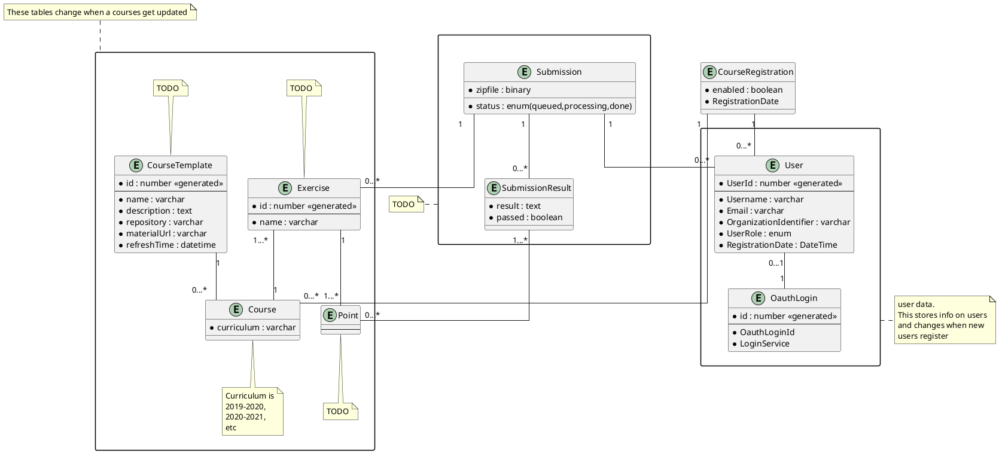

## Data storage

```plantuml
@startuml
skinparam linetype ortho
'polyline
skinparam handwritten false
skinparam packageStyle rectangle

package "" as UserPackage {
  entity User {
    * UserId : number <<generated>>
    --
    * Username : varchar
    * Email : varchar
    * OrganizationIdentifier : varchar
    * UserRole : enum
    * RegistrationDate : DateTime
  }

  entity OauthLogin {
  * id : number <<generated>>
  ---
  * OauthLoginId
  * LoginService
  }

  User "0...1" -- "1" OauthLogin
}
note bottom of UserPackage : user data.\nThis stores info on users\nand changes when new\nusers register

package "" as CoursePackage {
  entity CourseTemplate {
    * id : number <<generated>>
    --
    * name : varchar
    * description : text
    * repository : varchar
    * materialUrl : varchar
    * refreshTime : datetime
  }
  note top: TODO

  entity Course {
    * curriculum : varchar
  }

  note bottom: Curriculum is\n2019-2020,\n2020-2021,\netc

  entity Exercise {
    * id : number <<generated>>
    ---
    * name : varchar
  }
  note top: TODO

  entity Point {
    ---
  }
  note bottom: TODO

  CourseTemplate "1" -- "0...*" Course

  Exercise "1" -- "1...*" Point
  Exercise "1...*" -- "1" Course
}
note top of CoursePackage : These tables change when a courses get updated

entity CourseRegistration {
  * enabled : boolean
  * RegistrationDate
}
CourseRegistration "1" -- "0...*" Course
CourseRegistration "1" -- "0...*" User


package "" as SubmissionPackage {
  entity Submission {
    *  zipfile : binary
    *  status : enum(queued,processing,done)
  }
  entity SubmissionResult {
    * result : text
    * passed : boolean
  }

  Submission "1" -- "0...*" User
  Submission "1" -- "0...*" Exercise

  Submission "1" -- "0...*" SubmissionResult
  SubmissionResult "1...*" -- "0...*" Point
}
note bottom of SubmissionPackage : TODO


@enduml
```

(syntax found at [plantuml](https://plantuml.com/ie-diagram))